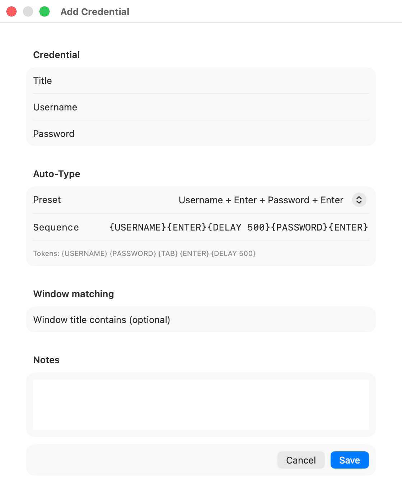

# KeyType

<p align="center">
  
</p>

原生 macOS 菜单栏凭据自动输入工具。

KeyType 将凭据元数据和密码分别存储在 macOS 用户登录 Keychain 中。只有自动输入序列执行到 `{PASSWORD}` 时才会读取密码，并且不会使用剪贴板传输密码。

## 功能

- 原生菜单栏操作，支持键盘优先的凭据选择器。
- 可选的窗口标题匹配，用于将更可能的凭据排在前面。
- 支持添加邮箱、租户、OTP 等自定义字段，并在自动输入序列中引用。
- 支持自动输入预设和自定义序列。
- 支持录制快捷键和一键重置；快捷键会被 KeyType 消费，不会继续触发当前应用的操作。
- 可选的“登录时启动”，使用 macOS `SMAppService`。
- 不发起网络请求，不包含浏览器扩展、遥测或剪贴板传输。

## 截图

### 新增凭据

<p align="center">
  
</p>

## 系统要求

- macOS 13 或更高版本。
- `make`、Swift 和 `codesign`（macOS Command Line Tools 已足够完成安装和运行）。
- 完整 Xcode 不是安装必需项，仅运行 XCTest 时需要。

## 安装

在项目目录执行：

```sh
make install
open ~/Applications/KeyType.app
```

`make install` 会自动构建应用，必要时组装 App Bundle，使用 ad-hoc 签名，并安装到 `~/Applications/KeyType.app`。

常用命令：

```sh
make build                         # 构建 build/KeyType.app
make install                       # 构建并安装应用
make run                           # 构建、安装并启动应用
make install INSTALL_DIR=/Applications
make test                          # 运行 XCTest，需要完整 Xcode
make clean                         # 删除构建产物
```

如果系统有完整 Xcode，Makefile 会使用 `KeyType.xcodeproj` 构建；否则会使用 SwiftPM fallback，仍然生成相同的本机 ad-hoc 签名 App Bundle。

## 首次使用

1. 从 `~/Applications/KeyType.app` 启动 KeyType。
2. 选择 **Add Credential**，填写标题、用户名和密码。标题也是凭据在列表中的显示名称。
3. 可选填写 **Window title contains**，帮助匹配特定应用或登录页面。
4. 保持默认的 **Password + Enter** 预设，也可以选择其他预设或直接编辑序列。
5. 按默认快捷键 `⌥⌘K`，选择凭据后按 Return 开始自动输入。

编辑已有凭据时，密码框留空会保留当前密码；输入新密码则会替换原密码。

## 匹配与选择

打开选择器时，KeyType 会在 macOS 提供信息的情况下记录当前最前端应用和窗口标题，然后结合目标窗口、可选的窗口标题规则和凭据标题进行排序。

搜索框会按凭据标题或用户名过滤。未输入搜索内容时，其他已保存凭据仍会显示，因此匹配到多个候选项时可以手动选择。使用 ↑/↓ 选择，Return 确认，Escape 取消。

开始输入前，KeyType 会再次确认原目标应用仍在最前端。如果焦点已经改变，自动输入会停止，避免把凭据输入到错误的应用中。

## 自动输入序列

序列支持以下 Token：

| Token | 动作 |
| --- | --- |
| `{USERNAME}` | 输入用户名 |
| `{PASSWORD}` | 读取并输入密码 |
| `{FIELD:NAME}` | 输入名为 `NAME` 的自定义字段 |
| `{TAB}` | 按 Tab |
| `{ENTER}` | 按 Return |
| `{DELAY 500}` | 等待 500 毫秒；支持 0 到 30,000 毫秒 |

示例：

```text
{PASSWORD}{ENTER}
{USERNAME}{TAB}{PASSWORD}{ENTER}
{USERNAME}{ENTER}{DELAY 500}{PASSWORD}{ENTER}
{FIELD:EMAIL}{TAB}{PASSWORD}{ENTER}
```

可以在凭据编辑器中添加自定义字段。字段名支持字母、数字和下划线，且不区分大小写；字段值会按保存内容输入，包括其中的空格。序列中直接写入的空格也会原样输入。

新建凭据时，预设默认选中 **Password + Enter**，序列为 `{PASSWORD}{ENTER}`。选择其他预设会覆盖输入框中的序列；直接编辑序列后，预设会变为 **Custom**。

## 快捷键

默认快捷键为 `⌥⌘K`。打开 **Settings**，点击快捷键控件，然后按下至少一个修饰键和一个按键即可录制。点击重置图标可恢复默认快捷键。

快捷键由 macOS 原生注册并由 KeyType 消费，因此不应同时触发浏览器中的打印等操作。如果组合键已被其他应用占用，请换一个组合键。

## 权限与安全

自动输入需要辅助功能权限；全局快捷键和打开选择器不需要该权限。

在以下位置启用：

**系统设置 → 隐私与安全性 → 辅助功能**

KeyType 使用辅助功能 API 检查聚焦窗口、恢复焦点、确认目标并发送键盘事件。由于这是本机菜单栏工具，项目有意关闭了 App Sandbox。

凭据以两个独立的登录 Keychain 项目存储：

- 元数据：`com.keytype.app.metadata`
- 密码：`com.keytype.app.password`

只有执行到 `{PASSWORD}` 步骤时才会读取密码。密码不会保存在选择器状态、UserDefaults、SwiftData、日志或剪贴板中。KeyType 不具备网络能力。

自定义字段会和凭据元数据一起存储在登录 Keychain 中，并在执行对应的 `{FIELD:NAME}` Token 时输入。

## 故障排查

### “Unable to identify the target application.”

请授予 KeyType 辅助功能权限，保持目标应用在最前端后重试。这个检查用于避免把凭据输入到其他应用。

### 快捷键没有反应

打开 **Settings**，重新录制一个“修饰键 + 按键”组合，并确认没有其他应用占用它。重置图标会恢复 `⌥⌘K`。

### Keychain 错误

请从 `~/Applications/KeyType.app` 启动已经安装的 App Bundle，不要直接运行 `.build/` 下的原始可执行文件，然后重试。KeyType 将数据存储在当前用户的登录 Keychain 中。

## 开发

```sh
make build
make test    # 需要完整 Xcode
make clean
```

单元测试位于 [`Tests/KeyTypeCoreTests`](Tests/KeyTypeCoreTests)。手动验证时，可以新增一个凭据，在 Terminal 或浏览器登录表单中执行自动输入，重启 KeyType 后确认凭据和自定义序列仍然存在。
